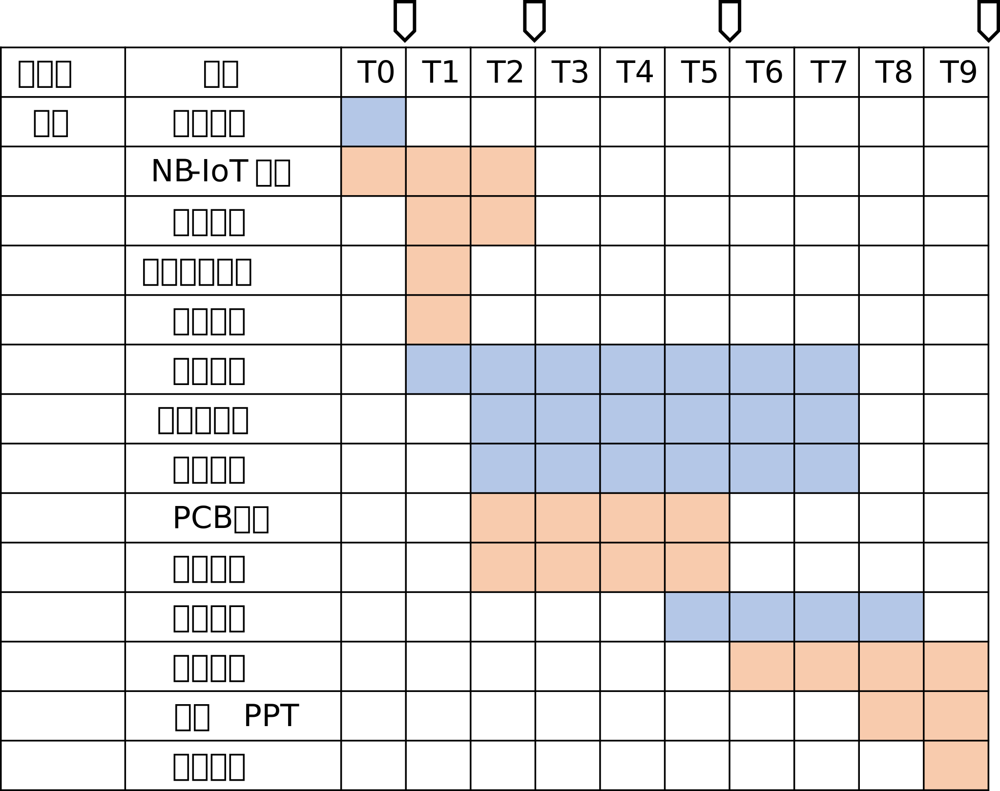
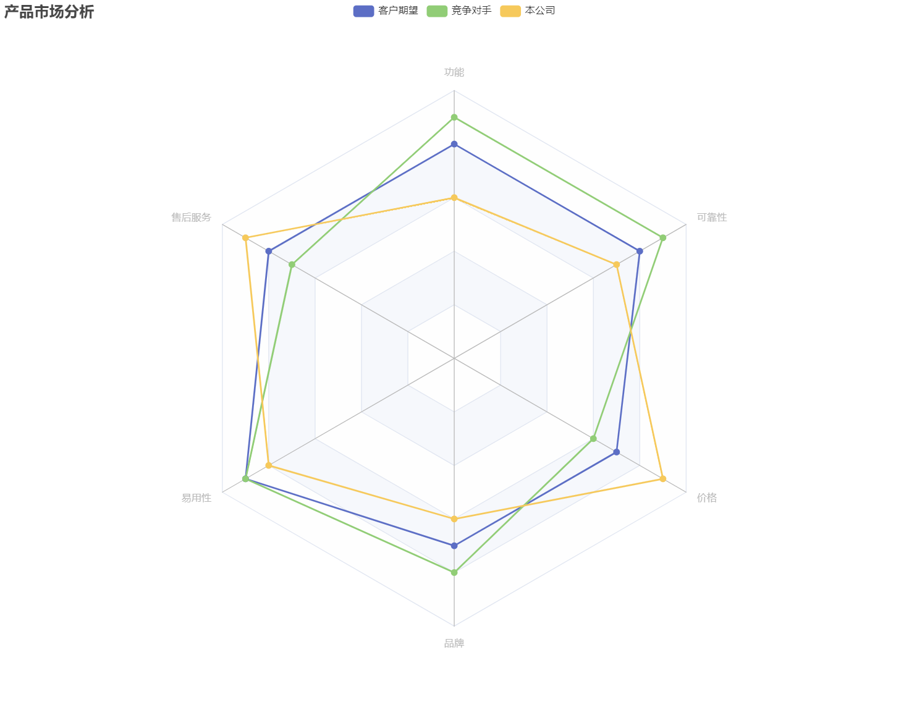

# 开题报告

## 项目背景

### 应用场景

在学校中生活学习，自行车可以为我们的行动提供交通上的便利。共享单车涉及浪涌问题，在时空上分布不均匀，自购电动车又涉及充电不便与充电安全的问题，所以大多数人都会选择自购自行车。

然而自行车使用过程中会有一些问题，找车难非常普遍。

在本项目中，我们将利用低成本的定位模块与通信模块实现一个便于安装的智能设备，为同学们提供10米以上的手机端定位+声光寻车。

### 用户痛点

骑自行车和步行存在一个trade-off的距离点。当距离较近时，找车+开车+锁车将会花费很大一部分时间，使得步行是更好的交通方式。

但自购的自行车在停车后，时常因为管理人员的挪动调整，或是自己的遗忘，而很难在短时间内被找到。在上下课之际，人多车杂、时间紧张时，成为影响效率的一个症结。

自行车的定位往往不太容易：

1. 共享单车基于运营厂商的定位系统，可以在APP上精确查找；
2. 电动车往往可以利用遥控声光等方式在一定范围内实现高效简单的定位；
3. 在自行车上增加显眼挂件，在夜晚使用也并不方便；
4. 定位模块不能经常充电，否则会极大影响使用体验；

我们试图结合共享单车的卫星定位+APP显示，以及电动车常用的声光提示，制作一个成本低廉、隐蔽的智能电子系统，便捷地解决找车难问题。

### 意义和重要性

我们试图将定位模块集成在手机支架、车铃、或是码表底座等本有实用价值的骑行配件上，从而减少外置与附加，同时相对固定、隐蔽，可以有效避免定位模块丢失。另一方面这要求我们实现有效的功耗控制。

基于这样的智能电子系统，我们将能几乎无感地使用自行车定位功能，在上下课、午饭等重要的时间节点上，更高效地找到自己的车。

## 竞品分析

现有技术和产品的调研，优缺点对比分析

## 项目目标

项目试图帮助同学们在校园这种人多车杂的环境下，在课间、饭点等时间节点快速完成找车，从而实现自行车的高效利用。

总体功能如下：

1. **外观**：将定位模块集成在手机支架、码表底座、车铃等实用骑行配件中，保证美观。

2. **电源**：使用小型纽扣电池，并对外留有插槽，并设置防水防尘。

   （可选，集成在手机支架中的情形）增加无线充电线圈，使得骑行过程中，可以使用手机反向无线OTG充电，从而实现免换电。

3. **定位**：在手机端APP查看自行车定位。基于卫星定位模块，实现2米尺度的精确定位；声光提示，在视距内实现。

   （可选）基于蓝牙模块辅助定位。

4. **码表**：与手机互联，完成语音播报导航；采集速度等运动传感器信息，在速度过快或导航过弯时进行减速提醒；检测运动状况，提醒休息；记录运行路径，生成健康统计。

基于上述功能，同学们不仅能在上课、饭点等时间紧张时快人一步，更能将其融入日常的骑行锻炼中。效率、健康两手抓，非常适合当代青年大学生的生活需要！

## 系统指标

相对精确的定位：在到达APP所提示的定位点与实际位置相差在2米以内。

接续的物理定位：在手机端遥控亮灯或响铃，提示车的实际位置。

换电或手机反向充电（可选）：正常换电池且在满荷下工作7天；或者利用手机进行反向OTG无线充电，时用时充免换电。

## 系统框架

## 系统原理

### 实现原理

**定位**：定位模块通过卫星获取自己的经纬度→ MCU 获取定位数据→通过NB-IoT模块传送到手机端→手机APP进行解析，并显示在地图上→到达地图定位点附近时，利用闪光或蜂鸣等方式提示车的位置→找到车。

**码表**：利用加速度传感器以及定位模块，记录位置、运动状态、运动轨迹→MCU获取定位数据和运动速度→通过NB-IoT模块传送到手机端→手机APP进行解析，并显示速度，在地图上显示运行轨迹记录。

### 关键功能的指标分析

远程定位需要有米级的精度，如果偏差较大，接续的物理提示将难以接收，大概需要保证精度能保证到达定位点后，能看到亮光或蜂鸣器的提示。

由于考虑到美观，我们试图将模块集成到手机支架等处，希望减少换电次数。所以需要有效控制待机时间

### 关键模块的指标分配

1. GPS定位模块传回定位数据：定位精度
2. NB-IoT通信模块：手机连接失败率
3. 电源模块：待机时间

## 开发计划

## 成本预算

## 工程伦理

1. 数据隐私：远程传送的定位信息只包括自行车所在的经纬度，并不包含其他敏感信息，同时由于车辆本身上锁，并不涉及偷盗风险。
2. 人与自然：我们将功耗控制放在很重要的位置，一方面是出于使用便利，另一方面有利于环境保护。
3. 安全性：在降低成本的同时注重模块可靠性，由于我们以自用为起点，定将加倍重视对用户人身财产安全的保护。

## 市场风险

## 技术风险

|         关键技术风险         |            相应对策            |
| :--------------------------: | :----------------------------: |
|         定位精度不足         |     利用蓝牙RSSI等进行辅助     |
| 低成本的通信模块连接失败率高 | 适当提高成本换用更好的通信模块 |
|    PCB设计问题或焊接失败     | 预先留足硬件开发时间，重新调整 |
|       反向OTG无线充电        |    使用纽扣电池或者有线反接    |
|    嵌入支架设备时出现问题    |   求助外援进行3D模型专门设计   |