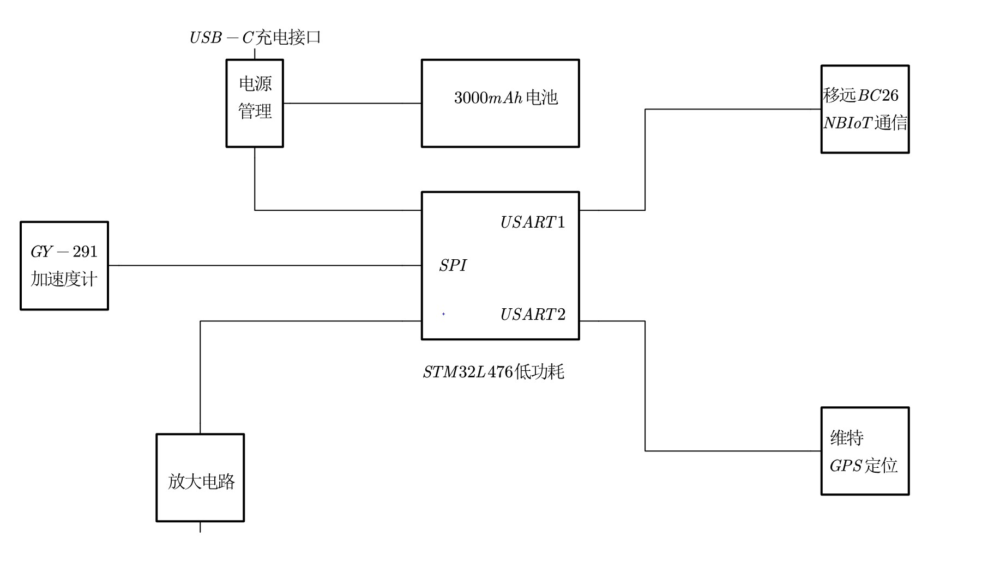
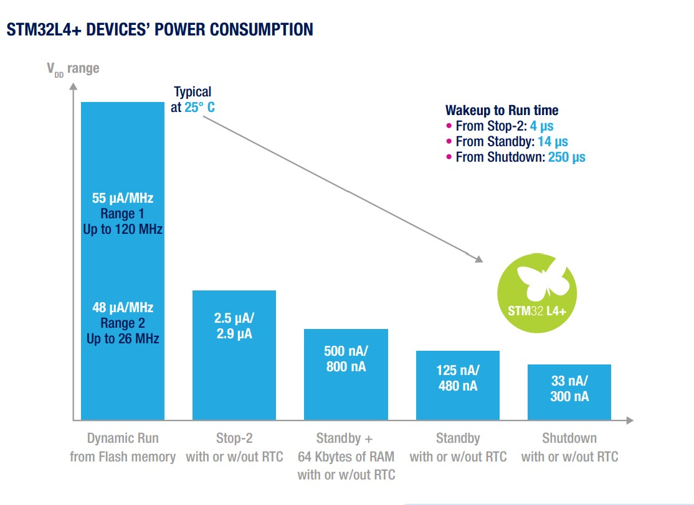
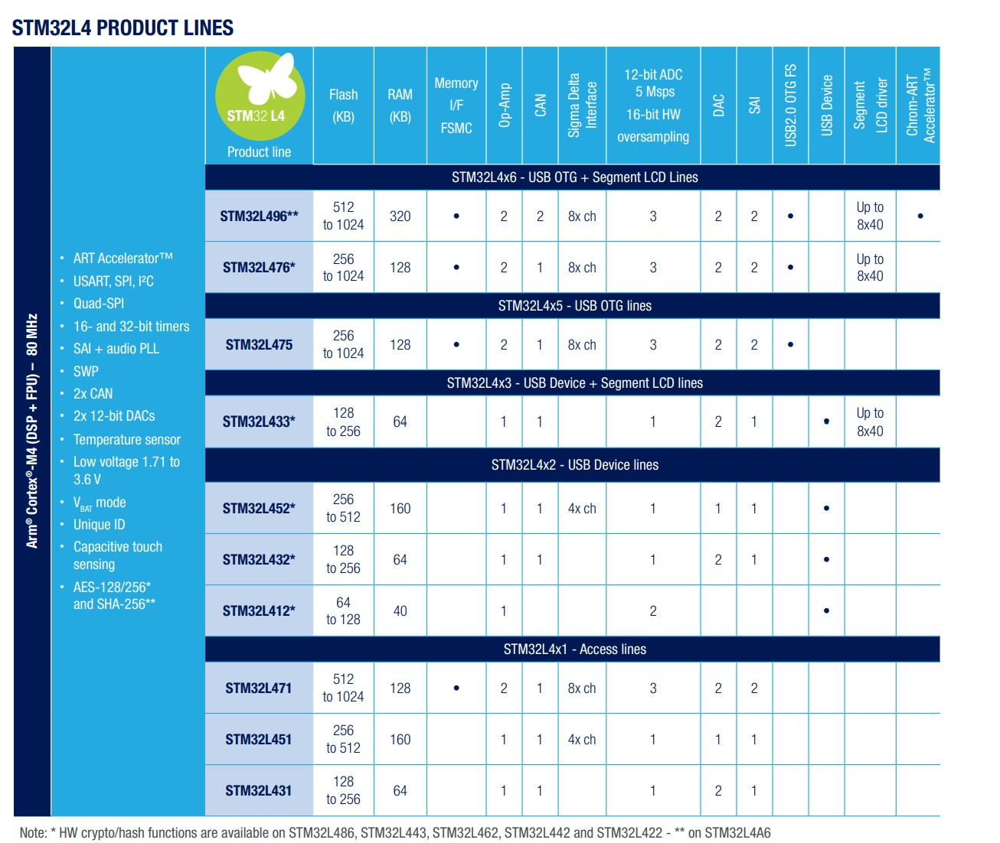
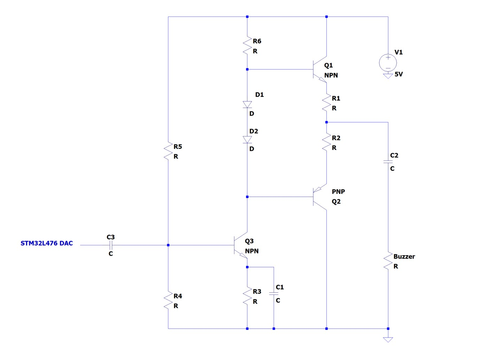
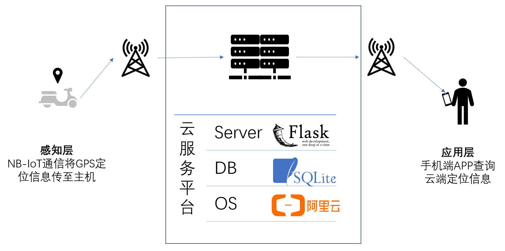
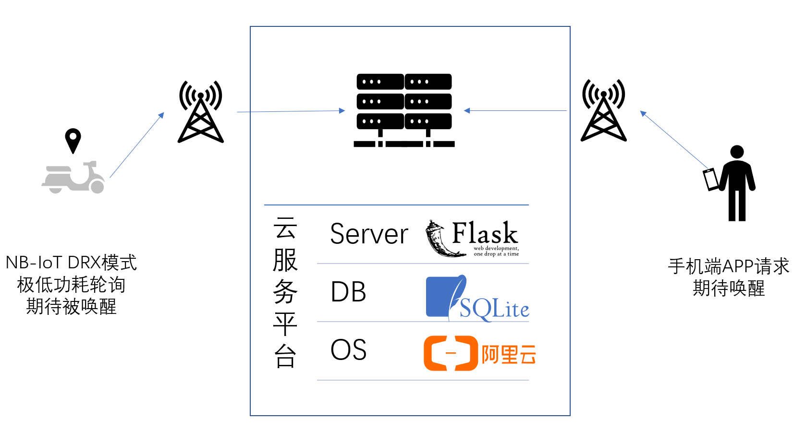
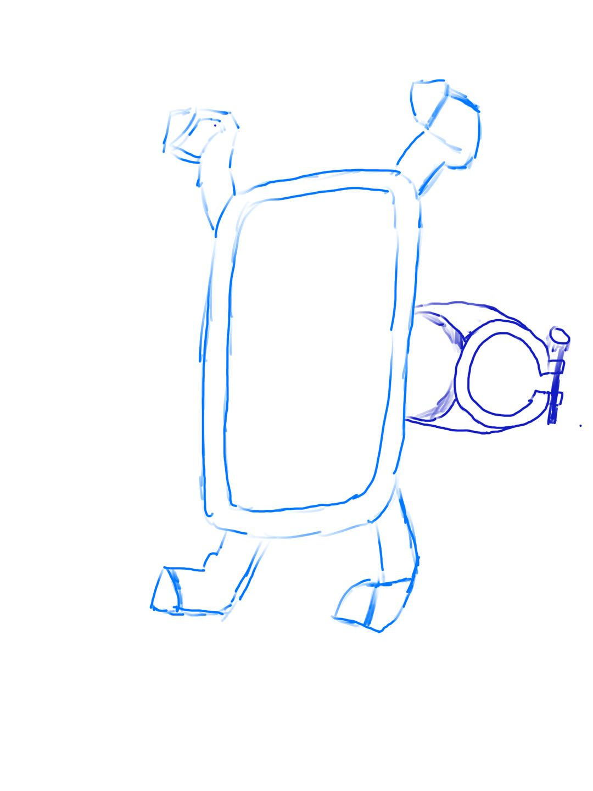

# 系统设计

## 1. 系统规范

应用场景

系统功能

系统指标

用户故事

## 2. 总体方案

总体架构图

## 3. 硬件详细设计

本项目采取以低功耗微控制芯片STM32L476为核心控制芯片，采取模块化设计思路，总体设计框图如下所示。



* 主控芯片为stm32L476超低功耗器件，契合本项目用途，其主要性能如图所示
<center class="half">
  
  
</center>

* 三轴加速度计选用GY-291，使用SPI总线和单片机通信

* NB-IoT通信选用移远BC26，占用单片机USART1串口进行通信

* 定位模块选用维特GPS，占用单片机USART2串口进行通信

* TP4056模块进行充电管理和保护，电池选取103450锂电池

* 单片机DAC输出到放大电路模块，由放大电路驱动蜂鸣器


##### 放大电路设计

由于单片机的DAC无法直接驱动负载，故结合需求设计了功率放大电路，电路原理图如下所示。



* 考虑到纯甲类功率放大电路效率较低，纯乙类功率放大电路存在交越失真，所以使用甲乙类功率放大电路进行折衷处理，可结合实际调试改变正负导通区的占周期比例。
* 二极管D1、D2是的推挽两端保持两个二极管的电压下降，克服交越失真
* R5、R4调整至中线点为2.5V
* R1、R2为保护电阻进行限流
* 具体数值仍需仿真测定

## 4. 软件详细设计

### 软件总体设计

本项目的嵌入式系统的主要功能是：

- 在自行车移动时向服务器发送定位信息。
- 收到服务器请求后控制蜂鸣器发出声音。

考虑到本嵌入式系统使用了多个使用批量指令进行控制的模块，我们决定引入操作系统，以同时等待各模块，提高响应速度。

该系统的软件运行在 Mbed OS 6 操作系统上，软件总体框图如下所示。


图中，主模块包含其他模块，表示其他模块是主模块的内部类。主模块（主线程）的流程图如下所示。


### 软件详细设计

#### 子模块流程图

由于硬件模块具有标准化的特点，所以各模块的软件设计可以有相似的架构。子模块（子线程）的通用流程图如下所示。


#### “等待”流程

注意到，主模块和子模块都有“等待”这一流程，在它们都进入等待状态时，Mbed OS 将自动进入睡眠模式（sleep mode）。

> In most cases, you don't need to call sleep() directly. Mbed OS enters sleep mode automatically any time the system is idle. That is when all your threads are in a waiting state, for example waiting for an event or a timeout.

由于涉及串口的使用，所以无法进入深度睡眠模式（deep sleep mode）。考虑主控是低功耗系列，我们决定不考虑深度睡眠模式带来的节能增益，而更多地研究降低外围模块的功耗。

“等待”流程基于 Mbed OS 提供的条件变量（conditional variable）实现。利用条件变量，可以在消息到来时唤醒线程，达到随时唤醒等待中的线程的目的。

#### 类设计

本嵌入式软件使用 C++ 进行开发，使用面向对象的设计思路，每个模块都使用一个类来表示。类的设计遵循资源获取即初始化（RAII）的原则，以在详细实现中尽可能避免考虑资源申请与释放的配对。

由于本嵌入式软件使用多个线程，所以需要注意类的成员函数的调用方。利用面向对象的封装性，各个子模块可以只向主模块开放由主线程调用的接口，而隐藏自身需要调用的子模块的接口或辅助函数。

## 5. 智能服务设计

本项目的云服务平台负责如下两项工作，其中定位器上的NB-IoT模块和手机端APP的请求都是异步的，加以我们的设计，可以极大减小功耗，并同时维持实用的延迟。

1. **定位信息传递**：定位信息的存储，保证用户端可以快速获取定位信息。车载端在停车进入休眠之前将定位信息传递到服务器，如果后续车辆因管理人员挪动等使得加速度计唤醒系统，则在进入新的休眠之前将定位信息传递到服务器；手机端在寻车时直接从云服务器获取车辆的停车信息。
2. **唤醒蜂鸣器**：如果到达指定地点附近后仍不能找到车辆（10米范围内），可以采用唤醒蜂鸣器的方式进入下一阶段寻车。车载端NB-IoT处于DRX模式慢速低功耗轮询服务器信息，检查状态并期待被唤醒；手机端如果发起唤醒请求，则将服务器端的唤醒变量触发，在DRX一个周期内（BC26模块的DRX周期为2.56秒）NB-IoT模块进入唤醒流程。

### 智能互联API设计

出于上述两个流程的考虑，我们有如下几个重要的接口：

- 车载端：
  - 更新定位信息：在最后一次停车活动完成并准备进入休眠之后，发送两个经纬度信息到服务器
  - 轮询状态信息：获取服务器端“手机端是否正在唤醒”的状态变量
- 手机端：
  - 获取定位信息：在寻车时，从服务器端获取经纬度信息
  - 更新状态信息：发送请求将服务器端的唤醒变量更新，并进入等待更新流程。

由于结构相对简单，我们预计使用Python Flask进行简明的Server端开发，上述四个API对应Flask程序中四个装饰器链接。

原理上相当于是两对get请求，具体的RESTful API不在系统设计中赘述。


### 数据库设计

由于我们只需要保存定位信息和一个是否等待唤醒的状态，我们实际上并没有时序信息、复杂的数据结构以及互斥访问，严格来讲，将上述三个量保存为json文件并更新即可。

对于经纬度信息，车载端是生产者，手机端是消费者；而对于唤醒状态信息，手机端是生产者，而车载端是消费者。这使得服务端访问数据的锁也无需格外设计。

```json
// position.json
{
    "longitude":xxxx,
    "latitude":xxxx
}

//isBeingCalled.json
{
    "is-being-called":false //default
}
```


但考虑到项目测试的需求，我们决定增加一套数据的日志系统，将改动的信息按时间戳及时保存到SQL数据库中。

项目中我们决定使用SQLite3：

1. 由于Python端对SQLite3支持更为紧密
2. 自行车在校园内停车时位置的隐私安全并不要紧，我们保存为本地的轻量SQLite3二进制.db文件即可。

为了防止读写互斥的问题，上述我们采用两个table进行存储：

|  字段名   |  字段类型   |          说明          |
| :-------: | :---------: | :--------------------: |
|  userID   | VARCHAR(20) |       设备用户名       |
|   time    |  TIMESTAMP  |  数据上传的日期和时间  |
| longitude | VARCHAR(20) | 经度，转换成字符串存储 |
| latitude  | VARCHAR(20) | 纬度，转换成字符串存储 |

| 字段名 |  字段类型   |          说明          |
| :----: | :---------: | :--------------------: |
| userID | VARCHAR(20) |       设备用户名       |
|  time  |  TIMESTAMP  | 用户发起唤醒请求的时间 |


### 人机界面设计

人机界面采用微信小程序开发，有如下优点：

1. 开发：基于传统前端开发组件，wxml+wxss是HTML和CSS的平台适配版，动态逻辑基于JavaScript，对前端开发更为有利
2. 调试：PC与手机端联动调试工具便捷
3. 部署：下载与安装轻量，同时基于微信的跨平台性能实现较好的移动端跨平台

同时，微信小程序内置腾讯地图模板，获取地理位置数据之后，只需进行简单的可视化即可。

### 智能服务设计

定位过程：



唤醒过程：



API是简明的get请求，示意如下。

```
Get domain/uploadPosition?longitude=xxx&latitude=xxx
Get domain/downloadPosition
Get domain/uploadAwakening?isBeingCalled=1
Get domain/downloadAwakening
```


## 6. 工业设计

外壳设计

设计草图如下:



## 7. 调试方案

测试场景

指标测试方案

